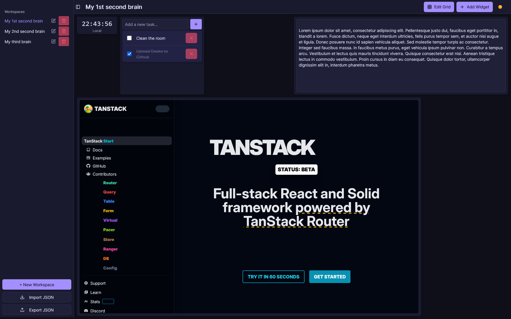

# 🚀 Desko – Project Guide



Welcome to Desko! This guide will help you understand the project structure, best practices, and get started quickly.

*NB: I don't claim it's perfect, but it's a great starting point for a fun and practical project!*

## 🛠️ Tools Used

- **TanStack Start**: Framework for React with file-based routing, SSR, and data-fetching.
- **Zustand**: Simple and efficient state management.
- **react-grid-layout**: For flexible widget layouts.
- **Shadcn UI**: Modern and accessible UI components, and they look great!

## 🏗️ Key Features

- **Local storage-based** : All data is stored in the browser's local storage, making it fast and offline-friendly.
- **Editable widgets...**: Users can add, remove, and edit widgets on their dashboard.
- **...in a grid layout**: Uses `react-grid-layout` for a flexible and responsive layout, allowing users to drag and drop widgets.
- **New widgets**: Easily add new widgets by creating new components in the `/modules/` directory. (and definitions, types, etc.)

## 🗂️ Project Structure

```text
project-root/
├── src/
│   ├── routes/            # Pages and layouts
│   │   ├── __root.tsx     # Root layout (mandatory)
│   │   ├── index.tsx      # Homepage
│   │   ├── w/             # Dynamic routes
│   │       └── $workspaceId.tsx
│   ├── router.tsx         # Router configuration (type-safe)
│   ├── routeTree.gen.ts   # Automatically generated (do not edit)
│   ├── components/        # Reusable UI components
│   ├── modules/           # Business modules (workspaces, widgets…)
│   ├── hooks/             # Custom hooks
│   ├── store/             # State management (Zustand)
│   ├── types/             # Global TypeScript types
│   ├── utils/             # Utility functions
│   └── styles/            # CSS/Tailwind
├── package.json
├── tsconfig.json
└── README.md
```

## 🚀 Quick Start

1. **Install dependencies**

   ```bash
   npm install
   ```

2. **Develop locally**

   ```bash
   npm run dev
   ```

## 📚 Useful Resources

- [TanStack Start – Documentation](https://tanstack.com/start/latest/docs/framework/react/hosting)
- [Zustand – Documentation](https://github.com/pmndrs/zustand)
- [react-grid-layout – Documentation](https://github.com/react-grid-layout/react-grid-layout)
- [Shadcn UI – Documentation](https://ui.shadcn.com/docs)

## 👋 About

This project follows TanStack Start conventions to ensure modularity, readability, and scalability. Feel free to adapt the structure to your business needs!

### Happy coding 🚀
